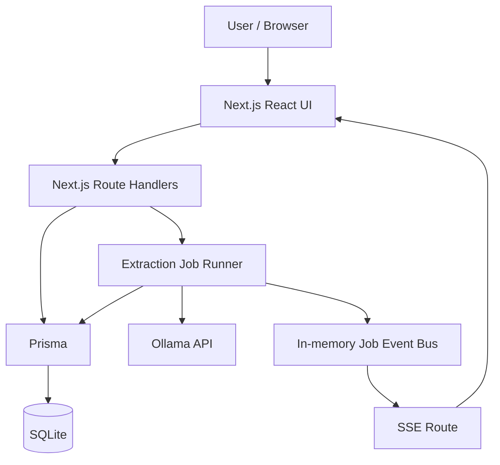

# Parse Engine — Project Definition and Architecture

## 1. Purpose

Parse Engine is a local-first batch structured-data extraction application. It accepts collections of raw text, sends each input to an Ollama-served language model using a reusable extraction instruction, and stores the resulting structured JSON for review and export.

The application is intended for workloads where many independent text inputs need to be converted into a consistent data shape, such as job postings, reports, customer feedback, invoices, forms, or research material.

The product is operated through a web interface and exposes local HTTP endpoints that can also be used for automation and data ingestion.

---

## 2. Design goals

The current architecture prioritizes:

- **local-first operation** — SQLite persistence and Ollama-based model inference can run on the same machine;
- **clear batch workflows** — inputs are grouped into datasets and processed through explicit extraction jobs;
- **reusable extraction definitions** — instructions are independent from datasets and jobs;
- **structured outputs** — optional JSON schemas constrain the expected model output;
- **recoverable execution** — restarting a partially processed job skips inputs that already have results;
- **observability** — each result stores the information needed to inspect what was sent to and returned by the model;
- **simple runtime coordination** — only one extraction job is allowed to run at a time;
- **minimal infrastructure** — the application requires Next.js, SQLite, and an Ollama endpoint rather than external application services.

---

## 3. System overview



### Main responsibilities

| Layer             | Responsibility                                                                      |
| ----------------- | ----------------------------------------------------------------------------------- |
| Browser UI        | Dataset management, instruction authoring, job control, progress, filtering, export |
| Next.js API       | Validation, persistence operations, job start/stop coordination, SSE endpoints      |
| Extraction runner | Sequential input processing, Ollama calls, result persistence, progress events      |
| Prisma            | Application data access and relation mapping                                        |
| SQLite            | Persistent datasets, inputs, instructions, jobs, and results                        |
| Ollama            | Model discovery and local/model-host inference                                      |

---

## 4. Domain model

The application has five persistent domain entities:

```text
Dataset
└── DatasetInput

Instruction

ExtractionJob
├── Dataset
├── Instruction
└── ExtractionResult[]

ExtractionResult
└── DatasetInput
```

### 4.1 Dataset

A `Dataset` is a named collection of raw text inputs that belong to the same processing context.

Examples:

- `Job Postings - August 2026`
- `Customer Feedback - Q3`
- `Supplier Invoices - Batch 04`

Key properties:

- `id` — UUID primary key;
- `name` — globally unique human-readable name;
- `slug` — globally unique URL-friendly identifier generated from the name;
- `description` — optional description;
- timestamps.

A dataset contains many `DatasetInput` records and can be referenced by multiple extraction jobs.

### 4.2 DatasetInput

A `DatasetInput` is one raw text item inside a dataset and is the atomic unit processed by an extraction job.

Key properties:

- `label` — human-readable input identifier;
- `content` — complete raw text;
- `contentHash` — SHA-1 hash of the trimmed content;
- `ingestionMethod` — `file_upload`, `manual_entry`, or `api`;
- `datasetId` — parent dataset reference.

The database enforces two uniqueness rules inside each dataset:

```text
(contentHash, datasetId)
(label, datasetId)
```

Therefore a dataset cannot contain the same normalized content twice or reuse the same label twice.

Duplicate detection is also performed in memory during batch ingestion so duplicate items within the same submitted batch are rejected before persistence.

### 4.3 Instruction

An `Instruction` defines what the model should extract.

Key properties:

- `title` — reusable instruction name;
- `prompt` — prompt template;
- `outputSchema` — optional JSON Schema-like object passed to Ollama as the structured output format.

#### Prompt insertion

The prompt may contain:

```text
{INPUT_TEXT}
```

Before an Ollama request, the runner replaces the placeholder with the current input content.

If the placeholder is absent, the runner appends the input content automatically. This guarantees that the dataset input is included in the rendered prompt sent to the model.

#### Supported schema-builder field types

The current UI schema builder supports:

```text
string
number
boolean
string[]
number[]
boolean[]
object[]
```

`object[]` supports flat sub-fields using the scalar and primitive-array types above.

### 4.4 ExtractionJob

An `ExtractionJob` is a reusable batch-processing configuration that connects:

- one Dataset;
- one Instruction;
- one Ollama model;
- model options.

Key configuration fields:

- `title`;
- `modelName`;
- `instructionId`;
- `datasetId`;
- `temperature`;
- `numCtx`;
- `think`.

Key runtime fields:

- `isRunning`;
- `startedAt`;
- `finishedAt`;
- `totalProcessingTimeSeconds`;
- `currentInputLabel`;
- `lastSuccessfulInputLabel`.

#### UI status model

The UI derives three states rather than storing a separate status column:

**Pending**

```text
isRunning = false
and the current dataset is not fully accounted for by results
```

This includes jobs that have never run, jobs stopped before completion, and jobs whose dataset received new inputs after a previous completion.

**Running**

```text
isRunning = true
```

**Completed**

```text
finishedAt exists
and
successfulResultCount + failedResultCount >= totalInputCount
and
totalInputCount > 0
```

### 4.5 ExtractionResult

An `ExtractionResult` records the outcome of processing one DatasetInput within one ExtractionJob.

The pair:

```text
(datasetInputId, extractionJobId)
```

is unique. A single input therefore has at most one result within a given job.

Key properties:

- `status` — `success` or `failed`;
- `inputLabel` — input label captured for the result;
- `contentHash` — source input content hash;
- `datasetInputId`;
- `extractionJobId`;
- `processedAt`;
- `processingDurationSeconds`;
- `extractedData`;
- `errorMessage`;
- `renderedPrompt`;
- `rawResponse`;
- Ollama usage/timing metrics.

The result is the persistent audit record for an extraction attempt.

---

## 5. Input ingestion

All UI and programmatic ingestion flows ultimately use the same core endpoint:

```text
POST /api/dataset-inputs
```

It accepts:

```json
{
  "datasetId": "...",
  "ingestionMethod": "file_upload | manual_entry | api",
  "inputs": [
    {
      "label": "...",
      "content": "..."
    }
  ]
}
```

### 5.1 File upload

The browser supports `.txt` files and folder selection.

The browser:

1. filters the selection to `.txt` files;
2. reads file content as UTF-8;
3. uses each file name as its input label;
4. submits the resulting label/content pairs to the core ingestion endpoint using `file_upload`.

### 5.2 Manual entry

The manual form supports multiple rows and an auto-label helper. It submits the rows using `manual_entry`.

### 5.3 Programmatic ingestion

External/local automation can use:

```text
POST /api/datasets/{slug}/inputs
```

The route resolves the dataset by slug and forwards the inputs through the same ingestion logic using the `api` ingestion method.

### 5.4 Duplicate detection

For each ingestion request, the server loads the dataset's existing content hashes and labels into memory.

Each submitted input is checked against:

1. already persisted dataset inputs;
2. earlier accepted items in the same request.

Possible duplicate reasons are:

```text
duplicate_content
duplicate_label
```

Valid inputs are persisted in one `createMany` operation.

---

## 6. Ollama integration

The application uses Ollama for both model discovery and extraction.

### Model discovery

`GET /api/ollama/models`:

1. reads installed models from Ollama's `/api/tags` endpoint;
2. calls `/api/show` for model capabilities;
3. marks models that advertise thinking support;
4. exposes the appropriate thinking-control type to the frontend.

### Model execution

The extraction runner uses the official Ollama JavaScript client and the chat API.

A model request includes:

- model name;
- one user message containing the fully rendered prompt;
- optional structured output format;
- temperature;
- optional `num_ctx`;
- optional `think` configuration.

The project uses a dedicated Undici agent with extended model-call timeouts because large local models can require substantial time before returning a response.

### Parsed output

The runner expects a JSON object in the final model response. The response is parsed and passed through `sanitizeExtractedData()` before persistence.

The sanitizer:

- trims string values;
- removes null/undefined/blank values;
- removes blank entries from primitive arrays;
- cleans flat objects inside object arrays;
- drops keys whose arrays become empty.

The original raw model response is retained separately for inspection.

---

## 7. Extraction-job execution

### 7.1 Start validation

Before a job starts, the API verifies:

1. no other extraction job is currently running;
2. the requested job exists;
3. its Instruction exists;
4. Ollama is reachable.

The application deliberately permits only one active job at a time.

### 7.2 Runner initialization

When `runExtractionJob(jobId)` starts, it loads:

- the job;
- its instruction;
- the dataset inputs;
- existing extraction results for that job.

Existing result records are used to determine which inputs should be skipped.

### 7.3 Sequential processing

Inputs are processed sequentially.

For every unprocessed input, the runner:

1. sets `currentInputLabel`;
2. emits a `processing` event;
3. renders the instruction prompt with the input content;
4. calls Ollama;
5. parses and sanitizes the returned JSON;
6. creates a successful or failed `ExtractionResult`;
7. updates job timing/progress fields;
8. emits the corresponding progress event.

A failure for one input does not terminate the whole job unless the failure represents an aborted request or loss of the Ollama connection.

### 7.4 Failed inputs

A normal model/parsing failure produces an `ExtractionResult` with:

```text
status = failed
```

The error message and audit information are stored with the result.

Because the job/input result pair is unique, failed inputs are considered accounted for when the same job is started again.

---

## 8. Stop and continue behavior

A running job can be stopped from the UI or API.

### Stop request

`POST /api/extraction-jobs/{jobId}/stop`:

1. verifies the job exists and is currently running;
2. sets an in-memory stop flag;
3. aborts the current Ollama request through its `AbortController`;
4. sets `isRunning` to false.

If the current model call is aborted, **no ExtractionResult is created for that interrupted input**.

The runner finalizes the current run, clears its runtime state, stores accumulated processing time, and emits a `stopped` SSE event.

### Starting the job again

The same extraction job can be started again later.

The runner loads all existing results for the job and skips every DatasetInput that already has a result, whether that result is successful or failed.

The previously interrupted input has no result, so it remains eligible for processing.

This provides continuation without duplicating already persisted results.

---

## 9. Real-time progress

The extraction runner publishes in-memory events through `lib/extractionJobEvents.ts`.

The browser subscribes through:

```text
GET /api/extraction-jobs/{jobId}/events
```

using Server-Sent Events (SSE).

Event types include:

| Event           | Meaning                                        |
| --------------- | ---------------------------------------------- |
| `started`       | Job execution began                            |
| `processing`    | An input is about to be processed              |
| `input_success` | A successful result was stored                 |
| `input_failed`  | A failed result was stored                     |
| `input_skipped` | The input already had a result and was skipped |
| `stopped`       | The current run was stopped                    |
| `completed`     | All eligible inputs were processed             |
| `heartbeat`     | Keeps the SSE connection alive                 |

The browser updates job counts and result lists from these events and falls back to a database snapshot when the stream closes or errors.

---

## 10. Result filtering

The UI computes facets from successful `extractedData` records.

### Supported facet shapes

Facets are generated from:

- scalar string/number/boolean values;
- primitive arrays;
- primitive sub-fields inside flat objects/object arrays.

Object sub-fields are represented with dot-separated facet keys such as:

```text
items.category
items.currency
```

### Filter semantics

- multiple selected values **within the same facet** use OR logic;
- active filters **across different facets** use AND logic.

A result must satisfy every active facet condition to remain visible.

---

## 11. JSON export

The UI exports all successful results for the selected extraction job, independent of the currently active filters.

Each exported row contains:

```json
{
  "inputLabel": "item-001",
  "processedAt": "2026-08-18T00:00:00.000Z",
  "processingDurationSeconds": 4,
  "data": {}
}
```

The output file name is based on the extraction-job title.

---

## 12. API surface

### Datasets

```text
GET  /api/datasets
POST /api/datasets
GET  /api/datasets/{slug}
GET  /api/datasets/{slug}/inputs
POST /api/datasets/{slug}/inputs
```

### Dataset inputs

```text
POST /api/dataset-inputs
GET  /api/dataset-inputs/{inputId}
```

### Instructions

```text
GET  /api/instructions
POST /api/instructions
```

### Extraction jobs

```text
GET  /api/extraction-jobs
POST /api/extraction-jobs
POST /api/extraction-jobs/{jobId}/start
POST /api/extraction-jobs/{jobId}/stop
GET  /api/extraction-jobs/{jobId}/events
GET  /api/extraction-jobs/{jobId}/results
```

### Ollama

```text
GET /api/ollama/models
```

The API currently has no authentication layer and is intended for local/trusted use.

---

## 13. Persistence and integrity rules

| Rule                                         | Enforcement                                           |
| -------------------------------------------- | ----------------------------------------------------- |
| Dataset name is globally unique              | SQLite unique constraint                              |
| Dataset slug is globally unique              | SQLite unique constraint                              |
| Content is unique within a dataset           | `(contentHash, datasetId)` unique constraint          |
| Label is unique within a dataset             | `(label, datasetId)` unique constraint                |
| One result per input/job pair                | `(datasetInputId, extractionJobId)` unique constraint |
| Result lookup by job/status is indexed       | `(extractionJobId, status)` index                     |
| Only one job runs at once                    | Start API validation                                  |
| Job cannot start while Ollama is unreachable | Start API health check                                |
| Stop only applies to a running job           | Stop API validation                                   |
| Prompt always includes the current input     | Runner prompt construction                            |

---

## 14. Data boundary and privacy model

Application records are stored in SQLite through the configured `DATABASE_URL`.

Model requests are sent to the server configured by `OLLAMA_URL`.

With the normal local configuration:

```text
OLLAMA_URL=http://127.0.0.1:11434
```

model inference and application persistence can remain on the same machine.

If `OLLAMA_URL` is changed to a host on another machine or network, the rendered prompt — including the dataset input content — is transmitted to that configured endpoint. The Ollama host must therefore be considered part of the application's trusted data boundary.

The application does not currently implement authentication or multi-user authorization. It should not be exposed directly to an untrusted/public network without additional access controls.

---

## 15. Current architectural constraints

The current design intentionally keeps several constraints simple:

- one running extraction job at a time;
- sequential input processing within a job;
- SQLite as the persistence layer;
- in-memory SSE event coordination within one application process;
- no authentication/multi-user model;
- `.txt` files only for browser file ingestion;
- no automatic retry of failed results within the same extraction job;
- JSON export is generated client-side from successful results.

These constraints keep the application predictable and appropriate for a local-first single-machine workflow.

---

## 16. Glossary

| Term              | Definition                                                                      |
| ----------------- | ------------------------------------------------------------------------------- |
| Dataset           | Named collection of raw text inputs                                             |
| Dataset Input     | One labeled raw text item inside a dataset                                      |
| Instruction       | Reusable prompt template plus optional output schema                            |
| Prompt Template   | Prompt text used to construct the model request for each input                  |
| Output Schema     | Structured output definition passed to Ollama when configured                   |
| Extraction Job    | Batch configuration connecting a dataset, instruction, model, and model options |
| Extraction Result | Persistent success/failure record for one dataset input within one job          |
| Extracted Data    | Parsed and sanitized JSON produced by the model                                 |
| Rendered Prompt   | Final prompt after the input content has been inserted                          |
| Ollama            | Model runtime/API used for extraction                                           |
| Facet             | Filter dimension computed from extracted result values                          |
| SSE               | Server-Sent Events used for live job progress                                   |
| Pending           | Job is not running and current dataset inputs are not fully accounted for       |
| Running           | Job is actively processing inputs                                               |
| Completed         | Every current dataset input has a success or failure result                     |
