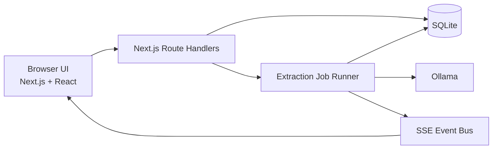

# Parse Engine

**Parse Engine** is a local-first web application for batch extraction of structured data from raw text using LLM models served by [Ollama](https://ollama.com/).

It lets you collect text into datasets, define reusable extraction instructions and output schemas, run local models over every input, inspect the results, filter extracted fields, and export successful results as JSON.

## Use cases

Parse Engine can be used for batch extraction workflows where large amounts of unstructured text need to be converted into consistent, structured records.

- **Invoice extraction** — extract invoice numbers, dates, suppliers, line items, quantities, prices, taxes, totals, currencies, and other fields from invoice text into structured JSON.

- **Job posting analysis** — process collections of job postings and extract information such as job titles, companies, locations, required skills, experience levels, technologies, responsibilities, employment types, and other attributes for later analysis or filtering.

- **Resume processing** — convert resume or CV text into structured candidate profiles containing skills, work experience, education, certifications, technologies, languages, and other relevant information.

- **Customer feedback analysis** — process reviews, survey responses, support messages, or other customer feedback and extract structured information such as topics, complaints, requested features, sentiment-related attributes, product references, and recurring issues.

- **Document and report extraction** — define custom schemas for repetitive documents, reports, forms, research material, or other text-heavy sources and transform them into structured records suitable for further processing.

Because extraction instructions and output schemas are reusable, the same workflow can be applied consistently across hundreds or thousands of inputs while keeping the model execution and application data within the configured local environment.

## Highlights

- **Local-first processing** — extraction requests are sent to the Ollama endpoint you configure.
- **Datasets** — organize raw text inputs into reusable collections.
- **Multiple ingestion methods** — add inputs manually, upload `.txt` files/folders, or use the HTTP API.
- **Duplicate protection** — duplicate labels and duplicate content are detected per dataset.
- **Reusable instructions** — define a prompt template and an optional structured output schema.
- **Local model selection** — automatically discovers models installed in Ollama.
- **Thinking-model support** — detects supported Ollama model capabilities and exposes reasoning controls when available.
- **Batch extraction jobs** — connect a dataset, instruction, model, and model options into a single job.
- **Stop and continue** — cancel a running extraction and start the same job again later; inputs that already have results are skipped.
- **Live progress** — Server-Sent Events (SSE) update the UI while a job is running.
- **Result audit trail** — stores the rendered prompt, raw model response, extracted JSON, timing, status, and usage metrics.
- **Faceted filtering** — filter successful results using values found in extracted fields.
- **JSON export** — export successful extraction results directly from the browser.
- **SQLite storage** — all application data is stored in a local SQLite database through Prisma.

## Core workflow

1. **Create a Dataset** and add the text inputs you want to process.
2. **Create an Instruction** containing a prompt template and, optionally, an output schema.
3. **Create an Extraction Job** by choosing the dataset, instruction, Ollama model, and model options.
4. **Run the job** and follow progress in real time.
5. **Review, filter, and export** the extraction results.

## Architecture



The application has two main execution paths:

- **Interactive UI:** the browser calls the Next.js API routes for datasets, instructions, jobs, and results.
- **Batch processing:** the server-side extraction runner loads pending dataset inputs, calls Ollama, stores results in SQLite, and emits progress events to the browser.

For a detailed description of the domain model and runtime behavior, see [PROJECT_DEFINITION.md](./PROJECT_DEFINITION.md).

## Tech stack

| Area                  | Technology                                            |
| --------------------- | ----------------------------------------------------- |
| Application framework | Next.js 16.2 (App Router)                             |
| UI                    | React 19, TypeScript, Tailwind CSS 4, shadcn/Radix UI |
| Local LLM runtime     | Ollama                                                |
| Database              | SQLite                                                |
| ORM                   | Prisma 7                                              |
| SQLite driver         | `better-sqlite3` + Prisma adapter                     |
| Live job updates      | Server-Sent Events (SSE)                              |
| Model HTTP transport  | Ollama JavaScript client + Undici                     |

## Requirements

Before running Parse Engine, install:

- **Node.js 20.9 or newer**
- **npm**
- **Ollama**
- at least one model installed in Ollama

Ollama normally exposes its local API at `http://127.0.0.1:11434`.

## Getting started

### 1. Install dependencies

```bash
npm install
```

### 2. Create your environment file

Copy `.env.example` to `.env` and adjust the values if needed.

```env
DATABASE_URL="file:./prisma/dev.db"
OLLAMA_URL="http://127.0.0.1:11434"
OLLAMA_CALL_TIMEOUT="600000"
```

`OLLAMA_CALL_TIMEOUT` is optional and is expressed in milliseconds. The application defaults to 10 minutes when it is not set.

### 3. Make sure Ollama is running

Install or pull at least one model. For example:

```bash
ollama pull gemma3
```

You can use any installed Ollama model that is suitable for your extraction workload.

### 4. Initialize the database

Create and apply the initial Prisma migration:

```bash
npm run prisma:migrate -- --name init
```

Then generate the Prisma Client:

```bash
npm run prisma:generate
```

> Prisma 7 does not automatically run `prisma generate` after `prisma migrate dev`, so both commands are required.

### 5. Start the application

```bash
npm run dev
```

Open:

```text
http://localhost:4000
```

## Environment variables

| Variable              |    Required | Default                           | Purpose                                                      |
| --------------------- | ----------: | --------------------------------- | ------------------------------------------------------------ |
| `DATABASE_URL`        | Recommended | `file:./prisma/dev.db` at runtime | SQLite connection URL                                        |
| `OLLAMA_URL`          |         Yes | —                                 | Base URL of the Ollama server, e.g. `http://127.0.0.1:11434` |
| `OLLAMA_CALL_TIMEOUT` |          No | `600000`                          | Maximum model-call duration in milliseconds                  |

## Dataset inputs

Inputs can be added in three ways.

### File upload

The UI supports individual `.txt` files, multiple `.txt` files, and folder selection. File contents are read in the browser, and file names become input labels.

### Manual entry

The manual entry form supports multiple rows and optional automatic label generation.

### HTTP API

Inputs can also be added programmatically using the dataset slug:

```http
POST /api/datasets/{slug}/inputs
Content-Type: application/json
```

```json
{
  "inputs": [
    {
      "label": "item-001",
      "content": "Raw text to extract..."
    },
    {
      "label": "item-002",
      "content": "Another text input..."
    }
  ]
}
```

The response reports how many inputs were added or skipped and identifies duplicate labels/content when applicable.

## Instructions and output schemas

An Instruction contains:

- a **title**;
- a **prompt template**;
- an optional **output schema**.

Use `{INPUT_TEXT}` in the prompt template to control where the current dataset input is inserted. If the placeholder is omitted, Parse Engine appends the input content automatically before the model call.

The schema builder supports:

- `string`
- `number`
- `boolean`
- `string[]`
- `number[]`
- `boolean[]`
- `object[]` with flat sub-fields

When a schema is provided, it is passed to Ollama as the structured output format for the request.

## Extraction jobs

An Extraction Job combines:

- one Dataset;
- one Instruction;
- one Ollama model;
- optional model settings such as temperature, context size, and thinking mode.

The UI presents three derived states:

- **Pending** — not currently running and not all dataset inputs have results;
- **Running** — actively processing inputs;
- **Completed** — every current dataset input has either a successful or failed result.

Only one extraction job can run at a time.

### Stop and continue behavior

Stopping a job cancels the active Ollama request. The interrupted input does not receive an extraction result.

Starting the job again loads the dataset and skips every input that already has an `ExtractionResult`. This means completed work is preserved and only inputs without results are sent to the model.

Failed results are also considered processed for that job and are skipped on subsequent starts.

## Results

Each extraction attempt stores an `ExtractionResult` with information such as:

- input label and content hash;
- success/failure status;
- extracted JSON data;
- error message when applicable;
- rendered prompt;
- raw model response;
- processing duration;
- Ollama usage/timing metrics.

Successful results can be filtered in the UI using facets generated from the extracted data.

### JSON export

The browser export contains successful results in this shape:

```json
[
  {
    "inputLabel": "item-001",
    "processedAt": "2026-08-18T00:00:00.000Z",
    "processingDurationSeconds": 4,
    "data": {
      "example_field": "example value"
    }
  }
]
```

## API overview

The UI uses the same local API routes exposed by the Next.js application.

| Method | Route                                  | Purpose                                       |
| ------ | -------------------------------------- | --------------------------------------------- |
| `GET`  | `/api/datasets`                        | List datasets                                 |
| `POST` | `/api/datasets`                        | Create a dataset                              |
| `GET`  | `/api/datasets/{slug}`                 | Get a dataset                                 |
| `GET`  | `/api/datasets/{slug}/inputs`          | List dataset inputs                           |
| `POST` | `/api/datasets/{slug}/inputs`          | Add inputs by dataset slug                    |
| `POST` | `/api/dataset-inputs`                  | Core input-ingestion endpoint                 |
| `GET`  | `/api/dataset-inputs/{inputId}`        | Get one dataset input                         |
| `GET`  | `/api/instructions`                    | List instructions                             |
| `POST` | `/api/instructions`                    | Create an instruction                         |
| `GET`  | `/api/extraction-jobs`                 | List extraction jobs                          |
| `POST` | `/api/extraction-jobs`                 | Create an extraction job                      |
| `POST` | `/api/extraction-jobs/{jobId}/start`   | Start or continue a job                       |
| `POST` | `/api/extraction-jobs/{jobId}/stop`    | Stop a running job                            |
| `GET`  | `/api/extraction-jobs/{jobId}/events`  | Stream job events over SSE                    |
| `GET`  | `/api/extraction-jobs/{jobId}/results` | Get job results                               |
| `GET`  | `/api/ollama/models`                   | List installed Ollama models and capabilities |

## Local-first data boundary

Parse Engine is designed to run on a local or otherwise trusted machine:

- application data is stored in the configured SQLite database;
- model prompts are sent to the server configured by `OLLAMA_URL`;
- with the default local Ollama address, model inference stays on the local machine;
- no hosted LLM API is required by the application.

If you configure `OLLAMA_URL` to point to another machine or remote service, extraction prompts and input content will be sent to that endpoint. Treat the configured Ollama host as part of your trusted data boundary.

### Deployment note

The application currently does **not** implement user authentication or authorization. It is intended for local/trusted use. Do not expose it directly to the public internet without adding appropriate access control and deployment hardening.

## Useful commands

```bash
npm run dev              # Start development server on port 4000
npm run build            # Create a production build
npm run start            # Start production server on port 4000
npm run lint             # Run ESLint
npm run prisma:generate  # Generate Prisma Client
npm run prisma:migrate   # Run Prisma development migrations
npm run prisma:studio    # Open Prisma Studio
```

## Project structure

```text
app/
  api/                    Next.js route handlers
  page.tsx                Main application shell and shared client state

components/
  dataset/                Dataset and input management
  instruction/            Instruction and schema-builder UI
  extraction-job/         Job configuration, progress, filtering, and results
  shadcn_ui/              Reusable UI primitives

lib/
  extractionJobRunner.ts  Batch processing engine
  extractionJobEvents.ts  In-memory SSE event bridge
  ollamaClient.ts         Ollama integration
  prisma.ts               Prisma Client singleton
  prismaHelpers.ts        Prisma/application data transformations
  sanitizeExtractedData.ts Output cleanup before persistence

prisma/
  schema.prisma           SQLite data model
```

## Further documentation

See [PROJECT_DEFINITION.md](./PROJECT_DEFINITION.md) for the detailed domain model, processing lifecycle, persistence rules, filtering behavior, and architectural constraints.

## Support the Developer

If this tool is useful to you and you'd like to support its development, you can support the developer.

Your support helps us dedicate more time to maintaining the project, improving the developer experience, and building new features.

<p align="center">
  <a href="https://buymeacoffee.com/tareqhrh">
    
  </a>
</p>

## License

This project is licensed under the MIT License. See the [LICENSE](./LICENSE) file for details.
